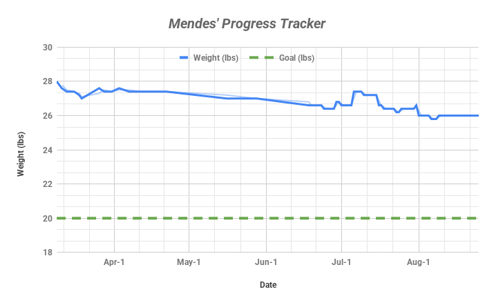

# pet-wellness-tracker

A personal data-tracking project to monitor Mendes' weight loss and activity using **Google Sheets**, **automated charts**, and **GitHub**. This project showcases practical skills in structured data collection, visualization, and workflow automation — applied in a real-world health scenario.

---

## Project Overview

- **Goal:** Help Mendes, a rescue dog, reach a healthy target weight of **20 lbs**
- **Tracked Metrics:**
  - Daily/weekly weight entries
  - Walking duration (AM/PM)
  - Caloric goals
  - Target progress
- **Tools Used:** Google Sheets · GitHub · Google Apps Script (coming soon)

---

## Live Chart Example



> *Automatically updated via Apps Script (in progress).*

---

## Repository Structure

```bash
pet-wellness-tracker/
├── charts/                 # Auto-generated chart image of weight progress
│   └── mendes_chart.png
├── data/                   # Source data log exported from Google Sheets
│   └── mendes_weight_log.csv
├── scripts/                # Automation code to export charts and upload to GitHub
│   └── export_chart_to_github.gs
└── README.md               # Project documentation
